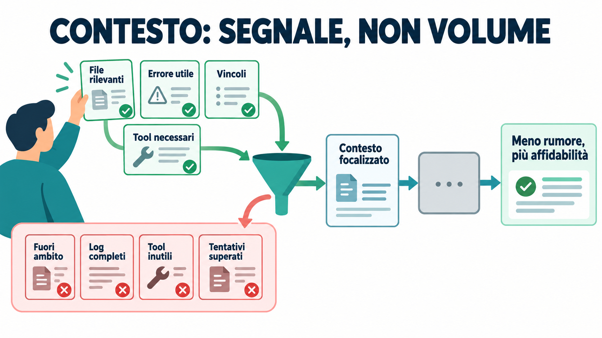
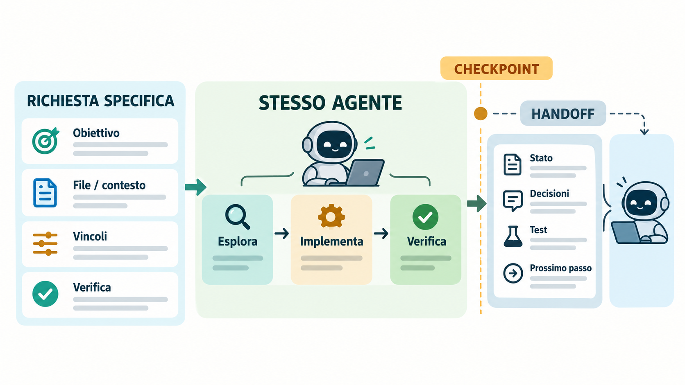
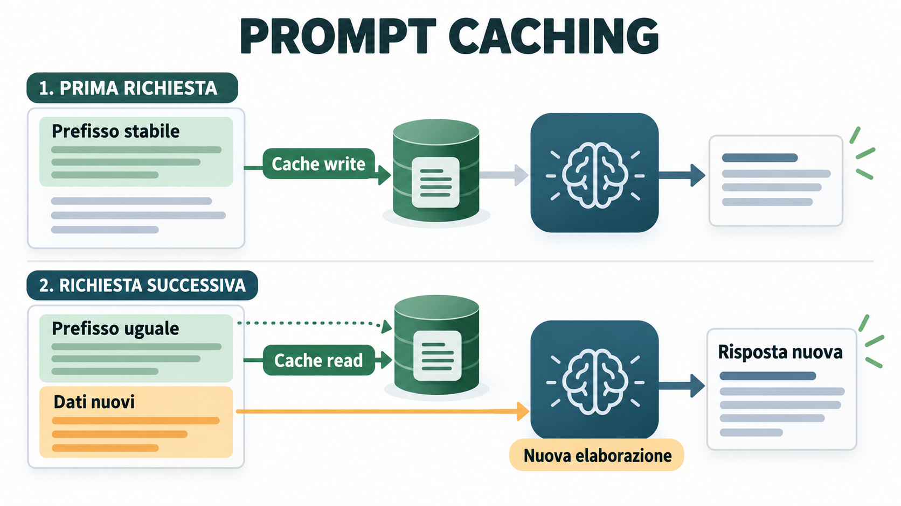
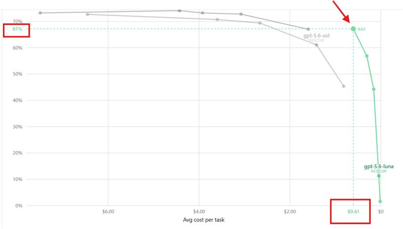
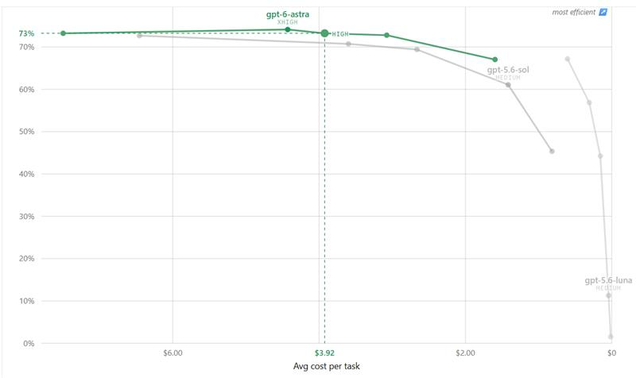
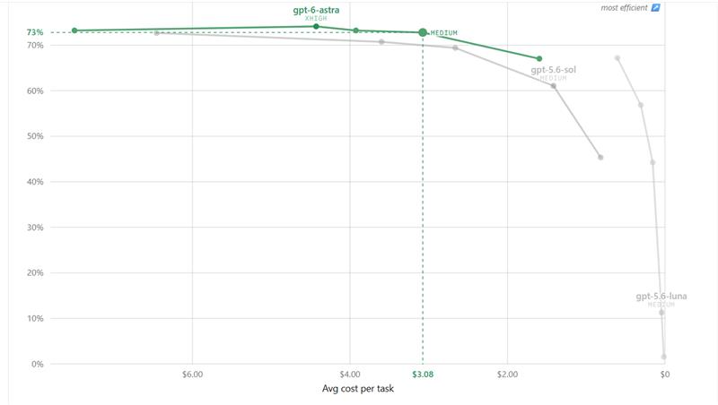

# Risparmiare token in Cursor

## Token, contesto e agenti: come spendere meno senza lavorare peggio

## Indice

1. [Token: che cosa sono](#1-token-che-cosa-sono)
2. [Contesto: definizione e composizione](#2-contesto-definizione-e-composizione)
3. [Ridurre il consumo nelle richieste](#3-ridurre-il-consumo-nelle-richieste)
4. [Come si forma il consumo](#4-come-si-forma-il-consumo)
5. [Gestire conversazioni lunghe e passaggi di fase](#5-gestire-conversazioni-lunghe-e-passaggi-di-fase)
6. [Prompt caching e cache hit](#6-prompt-caching-e-cache-hit)
7. [Modello, effort e Auto](#7-modello-effort-e-auto)
8. [Misurare il costo reale](#8-misurare-il-costo-reale)
9. [Leggere i benchmark](#9-leggere-i-benchmark-senza-farsi-ingannare)
10. [Procedura consigliata](#10-procedura-consigliata)
11. [Checklist rapida](#checklist-rapida)

## Introduzione

Questa guida parte dai concetti fondamentali — token e contesto — e procede verso pratiche via via più specifiche per lavorare in Cursor: ridurre il consumo delle richieste, gestire conversazioni lunghe, favorire i cache hit e scegliere modello ed effort in modo consapevole. Puoi leggerla dall'inizio per costruire una visione completa oppure consultare l'indice per trovare una pratica precisa.

Risparmiare token non significa chiedere sempre la risposta più corta o scegliere automaticamente il modello con il prezzo più basso. L'obiettivo corretto è ridurre il **costo per risultato riuscito**: il lavoro deve arrivare alla soluzione con pochi passaggi inutili, poco contesto irrilevante e un livello di ragionamento proporzionato alla difficoltà.

In Cursor il consumo dipende dal contenuto inviato al modello, da ciò che il modello genera, dalle eventuali cache, dal modello scelto e dal numero di passaggi dell'agente. Il prezzo e le modalità di conteggio cambiano nel tempo e possono dipendere dal piano: per i valori aggiornati va consultata la pagina ufficiale [Models & Pricing](https://cursor.com/docs/models-and-pricing).

La regola più utile è questa:

> Dai all'agente il contesto minimo che gli permette di fare bene il lavoro, mantieni stabile il flusso mentre il task è in corso e misura il costo del risultato completo, non solo quello della singola risposta.

## In breve

- Un token non è una parola: è un'unità di testo determinata dal tokenizer del modello.
- Il contesto è molto più del prompt: comprende cronologia, file, regole, tool, output dei tool, MCP, skill e istruzioni di sistema.
- La *prompt specificity* misura quanto la richiesta sia concreta e attuabile, non quanto è lunga.
- Il numero di `cache read` può superare la finestra del modello: nel dashboard può essere il totale di molte chiamate interne, non la dimensione di un singolo prompt.
- Ogni esplorazione, chiamata a un tool, errore e retry può aggiungere nuovi token e nuovi passaggi.
- Tool MCP e istruzioni di skill possono occupare contesto anche quando non servono al task corrente.
- Per modifiche locali valuta Tab o inline edit; usa Agent per richieste che richiedono esplorazione o più passaggi, secondo le funzioni incluse nel tuo piano.
- Una nuova chat aiuta a separare task indipendenti, ma non è un reset gratuito né una garanzia di costo inferiore.
- Le skill native circoscritte al task sono spesso più facili da ottimizzare di un grande file di regole sempre attivo; JSON da solo non garantisce meno token.
- Un task coerente dovrebbe restare con lo stesso agente o modello fino a un checkpoint naturale.
- Cambiare agente nel mezzo non è vietato da Cursor, ma può costringere il nuovo agente a ricostruire decisioni, stato e contesto. Se il cambio è necessario, prepara un handoff.
- Il confronto corretto è tra configurazioni che completano lo stesso lavoro: costo, qualità, passaggi, tempo e rework.

## 1. Token: che cosa sono

I modelli linguistici non elaborano il testo come una sequenza di parole intere. Lo dividono in **token**, che possono essere parole brevi, parti di parole, spazi, punteggiatura o simboli. La tokenizzazione dipende dal modello, dal suo encoding e dalla lingua: una stima basata sul numero di parole è quindi solo orientativa.

[OpenAI spiega](https://help.openai.com/en/articles/4936856-understanding-and-counting-tokens) che un token può rappresentare un carattere, una parte di parola, una parola o un segno di punteggiatura; inoltre il conteggio del testo semplice non coincide necessariamente con quello della richiesta completa, perché contano anche ruoli dei messaggi, tool, schemi, file e immagini.

Per l'italiano, il codice e i nomi tecnici le stime molto approssimative come "un token ogni qualche carattere" possono essere fuorvianti. Per dati reali usa il conteggio mostrato da Cursor o il tokenizer del modello interessato.

### La lingua può cambiare il conteggio, ma non scegliere solo in base a questo

Alcuni tokenizer rappresentano l'inglese in modo più compatto, perché il vocabolario e i dati usati per costruirli possono favorire sequenze inglesi frequenti. Il divario, però, dipende da tokenizer, modello, testo e task: le percentuali pubblicate non si trasferiscono automaticamente da una lingua o da un modello all'altro. Per esempio, la stima del 25–55% citata da Paul Simmering riguarda prompt giapponesi riscritti in inglese su alcuni modelli occidentali, non prompt italiani in Cursor. Le tabelle generiche che assegnano un rapporto fisso fra lingua e token sono indicative, non previsioni valide per ogni modello e testo.

Non tradurre automaticamente in inglese per risparmiare. Una traduzione può perdere sfumature; se la chiedi al modello, può aggiungere un passaggio e token. In ogni caso, non riduce il contesto del repository già inviato, che può includere codice, commenti e documentazione. Se il task è ripetuto e il risparmio può contare, confronta due formulazioni semanticamente equivalenti con il tokenizer del modello scelto o con l'uso effettivo mostrato da Cursor; mantieni la lingua in cui sai esprimere meglio requisiti e vincoli. Non abbreviare identificatori o codice per inseguire un conteggio minore.

## 2. Contesto: definizione e composizione

### Finestra di contesto

La **finestra di contesto** è la quantità massima di token che il modello può considerare in una richiesta, includendo input e spazio riservato all'output. Non è un credito e non è una misura diretta della qualità: una finestra grande permette di includere più materiale, ma non rende automaticamente utile tutto quel materiale.

Cursor descrive ogni chat come una finestra che si riempie con file, conversazione e risultati dei tool. La vista del contesto può separare, tra gli altri elementi, prompt di sistema, tool, regole, skill, MCP, subagent, conversazione riassunta e conversazione originale ([Prompting agents](https://cursor.com/docs/agent/prompting)).

### Com'è composto il contesto

Il contesto non è solo il testo dell'ultimo messaggio. A seconda del prodotto, della modalità e del task, può includere:

| Parte | Che cosa può contenere |
|---|---|
| Istruzioni | Prompt di sistema, regole del progetto, skill e preferenze attive. |
| Conversazione | Richieste e risposte precedenti, decisioni e sintesi della cronologia. |
| Repository | File e cartelle referenziati, codice recuperato con la ricerca, diff e stato del lavoro. |
| Tool e integrazioni | Definizioni e schemi degli strumenti, server MCP e risultati delle chiamate. |
| Lavoro dell'agente | Piani, output dei tool, log, errori e modifiche già proposte o applicate. |

Non tutti gli elementi vengono inclusi allo stesso modo in ogni richiesta. In Cursor, la vista del contesto può mostrare categorie come prompt di sistema, tool, regole, skill, MCP, subagent e conversazione originale o riassunta ([Prompting agents](https://cursor.com/docs/agent/prompting)).

Il prompt engineering riguarda soprattutto come formulare le istruzioni. Il **context engineering** riguarda invece la selezione e la manutenzione di tutto ciò che il modello riceve: istruzioni, cronologia, file, tool, stato del repository, log e decisioni precedenti.

[Anthropic definisce il contesto come l'insieme dei token disponibili durante l'inferenza](https://www.anthropic.com/engineering/effective-context-engineering-for-ai-agents) e suggerisce di curare il più piccolo insieme di informazioni ad alto segnale che permetta di ottenere il risultato. Il principio è generale e vale anche quando si lavora in Cursor.

### Intenzione e stato

È utile separare due tipi di informazione, distinti anche nella guida di Cursor [Working with Context](https://docs.cursor.com/en/guides/working-with-context):

- **Intenzione:** che cosa vuoi ottenere, quali vincoli devono essere rispettati e quale formato deve avere il risultato.
- **Stato:** che cosa esiste ora, quali file sono coinvolti, quali errori si verificano, che cosa è già stato modificato e quali test sono falliti.

Un buon prompt contiene entrambi. Dire soltanto "sistema questo bug" lascia all'agente troppo lavoro di ricostruzione; incollare tutto il repository senza spiegare l'obiettivo aggiunge volume ma non necessariamente chiarezza.

### Context degradation: il contesto lungo non è sempre contesto utile

Questo fenomeno è spesso chiamato *context rot* o *context degradation*. Non è un overflow: può presentarsi prima che la finestra sia piena. Nel report tecnico di Chroma, prove controllate su 18 modelli hanno mostrato prestazioni meno affidabili al crescere della lunghezza dell'input in diversi compiti, con un peggioramento ulteriore quando si aggiungono informazioni distraenti. Non tutti i 18 modelli compaiono in ogni esperimento. Il report isola variabili sperimentali: non dimostra che ogni conversazione lunga peggiori in modo lineare, né stabilisce una soglia universale per Cursor. La guida di Morph offre una lettura applicata agli agenti di coding, ma contiene anche risultati e proposte dei prodotti dell'azienda: i suoi numeri specifici non vanno generalizzati senza verificarne metodo e ambito.

La conseguenza pratica è curare qualità e pertinenza, non solo capienza:

- restringi le ricerche e non riversare nel contesto ogni corrispondenza o file candidato;
- conserva le evidenze utili, le decisioni e i vincoli; lascia fuori tentativi superati e piste scartate;
- fai un checkpoint o una sintesi quando cambia fase, non solo quando la finestra è quasi piena;
- dopo la sintesi, verifica che i fatti importanti e i riferimenti ai file siano ancora presenti;
- considera delega o chat separata per esplorazioni indipendenti solo se il risultato torna come breve elenco di file e fatti verificabili: più agenti non significano automaticamente meno token o costo.



*Figura. Ridurre il rumore è una buona pratica di context engineering, non una garanzia matematica di maggiore affidabilità.*

La compattazione può rendere il contesto più maneggevole, ma non annulla eventuali errori già introdotti né garantisce che la sintesi conservi ogni dettaglio. Per questo prevenire rumore e controllare i checkpoint resta utile anche con una finestra ampia.

Per esempio, invece di "Perché non funziona?", indica il simbolo e il comportamento: "Perché `validateLoginForm` in `src/auth/login.ts` accetta una password composta solo da spazi quando viene chiamata dal form di registrazione?" Il riferimento preciso può ridurre ricerche e letture superflue; non è un risparmio automatico di token se il file o la spiegazione allegati diventano più ampi del necessario.

## 3. Ridurre il consumo nelle richieste

### Scrivere richieste che riducono esplorazione e output

Una richiesta efficace non deve essere lunga: deve eliminare ambiguità.

```text
Obiettivo:
  [una frase sul risultato da ottenere]

Ambito:
  [file, cartelle, componenti o API interessati]

Fuori ambito:
  [ciò che non deve essere modificato]

Contesto di stato:
  [errore, comportamento attuale, diff o vincoli tecnici]

Vincoli:
  [compatibilità, stile, dipendenze, sicurezza, performance]

Criteri di accettazione:
  - [...]
  - [...]

Verifica:
  [test, lint, comando o controllo manuale da eseguire]

Formato della risposta:
  [solo risultato, file modificati, test e blocchi]
```

### Prompt specificity: concretezza, non lunghezza

Una rubrica pratica per la **Prompt Specificity** distingue tre livelli in base alla quantità di guida azionabile. Una richiesta vaga, senza riferimenti al codice, criteri di accettazione o vincoli, è a bassa specificità; se contiene uno di questi elementi è più guidata; se unisce riferimenti, criteri e vincoli rilevanti, o definisce chiaramente il risultato, è ad alta specificità.

Per aumentare la specificità senza gonfiare il prompt, includi solo gli elementi pertinenti:

- obiettivo e comportamento atteso;
- file, funzione o componente coinvolto, se noto;
- comportamento attuale o condizione che riproduce il problema;
- vincoli e ciò che è fuori ambito;
- criterio di accettazione o verifica.

Non serve compilare tutti i campi per ogni micro-task: "Rinomina `userID` in `userId` in questo file" è già concreto. Al contrario, un prompt lungo può restare poco specifico se contiene molto contesto senza dire quale risultato ottenere. Considera il punteggio come un segnale da confrontare con correttezza al primo tentativo, chiarimenti, tool call, retry e costo per risultato riuscito; non come un obiettivo da massimizzare aggiungendo dettagli irrilevanti.



*Figura. Specificità utile e continuità del lavoro riducono ambiguità; se serve cambiare agente, un checkpoint rende esplicito lo stato da trasferire.*

### Ridurre l'output senza impoverire il lavoro

- chiedi il diff e un riepilogo, non la ristampa di file già modificati;
- specifica il formato della risposta;
- chiedi spiegazioni estese solo quando servono per imparare o decidere;
- chiedi di fermarsi dopo l'analisi quando vuoi prima approvare il piano;
- dai un criterio di completamento, così l'agente non continua a esplorare senza limite;
- chiedi di non ripetere il prompt o il piano a ogni turno;
- per una modifica locale, preferisci un modello rapido e un contesto piccolo;
- per un task multi-file incerto, può convenire un modello più capace se riduce retry e rework.

Un prompt come "sii più breve" può ridurre il testo visibile, ma non elimina necessariamente tool call, input, reasoning o esplorazione. La leva principale resta il perimetro.

Per una correzione locale o un completamento breve, prova Cursor Tab o l'editing inline invece di avviare una sessione Agent multi-passaggio. Tab è una funzione distinta che suggerisce codice in base alle modifiche recenti, al contesto circostante e agli errori del linter ([documentazione Tab](https://prod.cursor.com/help/ai-features/tab)). Al 4 ottobre 2026, [Pro, Pro Plus e Ultra includono completamenti Tab illimitati](https://cursor.com/docs/models-and-pricing); il piano Hobby ha limiti. È quindi una buona alternativa per gli utenti a cui è inclusa, ma non un consiglio universale per ogni piano o metrica di utilizzo.

### Skill di brevità: poche regole, ambito chiaro

Una skill per risposte concise dovrebbe specificare che cosa tagliare e che cosa non sacrificare. Regole brevi e verificabili tendono a essere più facili da seguire di una lunga lista di divieti ed esempi. Per esempio:

```text
Rispondi in modo diretto. Elimina formule di cortesia e ripetizioni;
mantieni precisi termini tecnici, vincoli e incertezze importanti.
Per i task di codice riporta modifica, verifica ed eventuali blocchi.
Non alterare codice, citazioni o log da riportare fedelmente.
```

Limita la skill ai contesti in cui serve: se è sempre attiva, le sue istruzioni entrano nel contesto anche per richieste che non beneficiano di uno stile telegrafico. In Cursor puoi circoscrivere una skill ai file pertinenti con `paths` oppure richiedere l'invocazione manuale con `disable-model-invocation: true`; mantieni brevi le istruzioni iniziali e carica dettagli di riferimento solo quando necessari. Evita regole come "non esprimere mai dubbi": possono rendere la risposta più corta, ma anche meno corretta o meno calibrata.

Una regola come "non eseguire comandi da terminale senza permesso" è una preferenza di sicurezza e controllo, non un trucco di risparmio; può essere giusta per il tuo flusso, ma le richieste di conferma possono aggiungere turni. Inseriscila nelle istruzioni persistenti solo se vuoi davvero questo comportamento in tutti i task.

Un benchmark indipendente di Kuba Guzik confronta un prompt "caveman" completo da 552 token con una versione breve da 85 token. Nei suoi test su due modelli Claude e due attività di sviluppo, la variante breve ha ridotto i token di output del 14% e 21%; quella completa del 13% e 9%. L'autore riporta risposte corrette in tutti i 72 tentativi, ma il campione è ristretto e non dimostra che quegli stessi risparmi si ripetano con altri modelli o task ([metodo e risultati](https://dev.to/jakguzik/i-benchmarked-the-viral-caveman-prompt-to-save-llm-tokens-then-my-6-line-version-beat-it-2o81)). Sono percentuali sull'output, non sul costo totale: per valutarle occorre includere anche i token della skill inviata, input, eventuali tool call, reasoning e retry. La lezione riutilizzabile è testare una versione breve contro una già concisa, mantenendo fissi task e criteri di qualità, e adottarla solo se migliora il costo per risultato corretto.

### Selezionare il contesto con precisione

Quando sai dove intervenire, usa riferimenti mirati:

- `@file` per un file specifico;
- `@code` per una funzione, classe o simbolo;
- `@folder` per una cartella quando la maggior parte del contenuto è pertinente;
- `@Git` o il diff corrente per modifiche già esistenti;
- `@Terminals` per un errore o un log concreto.

La documentazione di Cursor su [@Files & Folders](https://docs.cursor.com/context/%40-symbols/%40-files-and-folders) distingue il riferimento a una cartella dal caricamento del suo contenuto completo. Quest'ultima opzione può aumentare molto i token di input, soprattutto con una cartella grande o con una modalità di contesto esteso.

Regole pratiche:

- non allegare l'intero workspace se servono tre file;
- non incollare una copia del file se puoi referenziarlo;
- non includere log completi quando bastano le righe dell'errore e il contesto immediatamente precedente;
- esegui prima il test più mirato e, se l'output è enorme, passa solo gli errori con le righe circostanti; quando filtri da terminale, conserva anche l'esito del comando originale;
- escludi documentazione generata, build, vendor, cache e file binari non pertinenti;
- usa `.cursorignore` o le impostazioni disponibili per ridurre il rumore, verificando però che non nascondano file necessari al task;
- se non conosci ancora i file giusti, lascia che Agent esplori, ma dagli un obiettivo e un'area di ricerca.

### Ricerca del codice con grep in Cursor

`grep` è uno strumento di ricerca testuale: trova stringhe o espressioni regolari nei file e mostra i percorsi e le righe corrispondenti, senza dover leggere a mano l'intero progetto. In Cursor Agent usa automaticamente **Instant Grep**, un motore di ricerca indicizzato locale, quando citi simboli precisi; supporta anche regex e confini di parola ([documentazione Cursor Search](https://cursor.com/docs/agent/tools/search)). Per esempio, una ricerca come `PaymentFailedError` trova i riferimenti esatti, mentre `import.*PaymentService` può aiutare a individuare import compatibili con un certo schema.

La ricerca in sé aiuta a restringere il campo, ma non azzera i token: quando Agent apre una corrispondenza, il contenuto del file può essere incluso nella richiesta al modello. Per questo è utile chiedere percorsi e righe pertinenti, poi approfondire solo i file necessari. Per esempio:

```text
Cerca `PaymentFailedError` nel progetto. Riporta i percorsi e le righe rilevanti;
apri solo i file necessari a capire dove viene generato e gestito l'errore.
```

La documentazione specifica che l'indice di Instant Grep viene costruito e interrogato sulla macchina e che Cursor non carica codice o percorsi per creare l'indice; questo non significa che il contenuto di un file aperto dall'agente non possa essere inviato al modello. Per ricerche da terminale, `rg -n "PaymentFailedError" src/` è un esempio dell'equivalente con ripgrep.

### Regole, skill, MCP e tool

Le istruzioni persistenti sono utili, ma ogni regola, skill, schema di tool o catalogo MCP può aggiungere contesto a più richieste. Una regola vale la pena quando evita ripetizioni, errori o rework più costoso dei token che introduce.

Mantieni quindi le regole:

- brevi e non contraddittorie;
- orientate a decisioni ripetibili;
- specifiche per il progetto o per il team;
- senza spiegazioni generiche che l'agente conosce già;
- separate dalle istruzioni valide solo per una singola richiesta.

Un catalogo MCP ampio può occupare contesto con descrizioni e schemi dei tool, anche prima che l'agente li invochi. Un utente Cursor ha riportato nel forum che, nella propria configurazione, prompt di sistema, definizioni dei tool, regole e skill occupavano circa 47.500 token di contesto iniziale senza file del repository: è un esempio personale, non un valore tipico garantito.

Per limitare il rumore:

- disattiva i server MCP non pertinenti al progetto;
- nella chat, disabilita i singoli tool che non servono; Cursor permette di attivarli o disattivarli dalla lista degli strumenti;
- se gestisci un server MCP, rendi selezionabili i tool e mantieni brevi descrizioni e schemi;
- abilita solo i tool necessari al task: riduce il contesto disponibile ai tool e limita chiamate accidentali;
- riattiva i tool quando cambia il lavoro e ti servono davvero.

Anche le skill vanno caricate con uno scopo chiaro. Cursor dichiara che le skill possono caricare le risorse in modo progressivo. Puoi contenere il loro impatto così:

- tieni il file `SKILL.md` focalizzato e sposta le spiegazioni lunghe in `references/`, da aprire solo quando servono;
- usa il campo `paths` per rendere disponibile una skill solo per i file a cui si applica;
- imposta `disable-model-invocation: true` se vuoi che una skill entri nel contesto solo quando la invochi esplicitamente con `/nome-skill`;
- evita di mantenere una Custom Mode o istruzione specialistica attiva dopo la fase per cui serve.

#### Skillset JSON annidati: selezione sì, formato magico no

In un [post del forum Cursor](https://forum.cursor.com/t/using-nested-json-skillsets-to-save-90-of-tokens-with-cursor/141399), un autore attribuisce al proprio sistema di skillset JSON annidati un risparmio dell'87% e miglioramenti di velocità e successo. È una testimonianza personale, non un benchmark indipendente: il post descrive anche un selettore MCP proprietario che recupera la conoscenza pertinente. Il beneficio plausibile è caricare solo la parte di conoscenza utile al task, non il fatto che i dati siano in JSON.

JSON non è intrinsecamente più compatto del Markdown: chiavi ripetute, parentesi e stringhe possono aumentare i token, mentre campi strutturati sono utili per schemi, contratti API e dati che un tool deve interpretare. Inoltre, mettere file in sottocartelle non garantisce che Cursor li carichi selettivamente: serve un meccanismo esplicito di selezione o recupero. Cursor documenta skill native in `SKILL.md`, cartelle annidate per organizzarle, attivazione su richiesta e ambito tramite `paths`. Parti da queste funzioni; adotta un indice JSON o un MCP solo se risolve un problema concreto e misura il costo totale, comprese descrizioni dei tool, ricerche e contenuto recuperato.

La critica alla *context pollution* è discussa anche da [Sam McLeod](https://smcleod.net/2025/08/stop-polluting-context-let-users-disable-individual-mcp-tools/), che mostra quanto le descrizioni dei tool possano variare e sostiene il controllo granulare. I suoi conteggi sono esempi del suo ambiente, non una misura ufficiale di Cursor. Le funzioni di Cursor sopra descritte sono documentate nella guida [MCP integrations](https://prod.cursor.com/help/customization/mcp) e nella guida [Agent Skills](https://cursor.com/docs/skills).

## 4. Come si forma il consumo


### Come un agente fa crescere il consumo

Una richiesta a un agente non è sempre un singolo prompt e una singola risposta. Un flusso tipico è:

```text
obiettivo + istruzioni + contesto iniziale
                    ↓
                 modello
                    ↓
             chiamata a un tool
                    ↓
          risultato del tool nel contesto
                    ↓
           nuovo passaggio del modello
                    ↺
```

Il modello può quindi:

1. cercare file e simboli;
2. leggere codice o documentazione;
3. proporre o applicare una modifica;
4. eseguire test o comandi;
5. leggere errori e log;
6. correggere la modifica;
7. ripetere il ciclo fino alla verifica.

I passaggi non sono una categoria separata di token, ma ogni passaggio può generare nuovo input, output, tool call e materiale da mantenere nel contesto. Per questo un modello economico per token può risultare più costoso sul task completo se esplora troppo, produce retry o richiede molto rework manuale.

Anche gli agenti in background o in parallelo servono soprattutto ad aumentare il throughput, non sono una scorciatoia garantita per risparmiare. Ogni agente può avviare la propria esplorazione, usare contesto e tool e produrre verifiche separate. Conviene parallelizzare attività davvero indipendenti quando il tempo risparmiato vale il costo aggiuntivo; per una modifica minima o ambigua, un solo agente è spesso più efficiente.

## 5. Gestire conversazioni lunghe e passaggi di fase

Cursor riassume o comprime automaticamente parti delle conversazioni quando la finestra si avvicina al limite; per file e cartelle usa strategie diverse di condensazione ([Summarization](https://docs.cursor.com/en/agent/chat/summarization)). La compressione evita di interrompere subito il lavoro, ma può perdere dettagli secondari o trasformare una decisione precisa in una sintesi troppo generica.

Non esiste una percentuale universale, come "quando arrivo al 50% devo aprire una nuova chat". È più utile osservare i sintomi:

- l'agente ripete ricerche già fatte;
- dimentica vincoli o decisioni;
- confonde file con nomi simili;
- reintroduce una soluzione già scartata;
- produce risposte più vaghe o più lunghe;
- aumenta il numero di retry;
- il contesto contiene ormai molti tentativi non più rilevanti.

La ricerca [Lost in the Middle](https://aclanthology.org/2024.tacl-1.9/) mostra che i modelli possono usare peggio le informazioni rilevanti quando sono immerse nel mezzo di contesti lunghi. Il risultato non significa che Cursor "dimentichi" automaticamente tutto, ma spiega perché più contesto non equivale sempre a più accuratezza.

### Quando conviene una nuova chat

Apri una nuova chat quando:

- inizi un task indipendente;
- il problema è cambiato sostanzialmente;
- la cronologia contiene molte strade abbandonate;
- la sintesi automatica non conserva più i dettagli importanti;
- vuoi confrontare due approcci senza contaminare il contesto.

Usa chat separate per task indipendenti: isoli obiettivi e decisioni e riduci la possibilità che una cronologia estranea interferisca. Ma "svuotare la chat" non è automaticamente il primo risparmio di denaro: il costo dipende dai token e dai passaggi, non dal numero di chat. Una nuova chat può dover ricevere di nuovo regole, strumenti, file e stato, e un handoff troppo dettagliato aggiunge altro input. Per continuare lo stesso task, resta nella chat se il contesto è ancora utile; riparti quando il rumore o i task estranei costano più della ricostruzione. Cursor comprime le conversazioni lunghe, quindi una chat nuova non è una garanzia di costo inferiore.

### Una chat per le fasi collegate della stessa feature

Se analisi, chiarimenti, soluzione, specifica e implementazione dipendono l'una dall'altra, puoi mantenerle nello stesso thread. Procedi per fasi: chiedi prima di analizzare senza modificare codice; fai domande successive sui punti emersi e chiedi di aggiornare l'analisi; prepara la soluzione; ricava dalla soluzione approvata criteri di accettazione e test; implementa un ticket alla volta. Nei messaggi successivi aggiungi la domanda specifica senza ripetere premesse, vincoli e risultati già presenti nella conversazione.

### Mantenere continuità e fare handoff

Questa è una delle best practice più importanti per contenere sia il costo sia il rework.

#### Che cosa significa "cambiare agente"

In Cursor si possono confondere tre cose diverse:

- **cambiare modello:** selezionare un altro modello dal model picker;
- **cambiare modalità o agent:** passare, per esempio, da Ask a Agent o a una Custom Mode con tool e istruzioni differenti;
- **cambiare chat:** iniziare una conversazione nuova, con una cronologia diversa.

Cursor consente di cambiare modello durante una conversazione e applica il cambio ai turni successivi ([Prompting agents](https://cursor.com/docs/agent/prompting)). Quindi non è corretto dire che il cambio sia tecnicamente impossibile o che cancelli sempre il contesto.

La raccomandazione pratica è però di **non cambiare agente o modello a ogni turno e di non farlo nel mezzo di una fase atomica**, per questi motivi:

1. il nuovo modello deve interpretare la cronologia o il suo riassunto, non il ragionamento interno non mostrato dal modello precedente;
2. può avere capacità, priorità, tool, regole o stile di esplorazione diversi;
3. può decidere di rileggere file e rieseguire verifiche già svolte;
4. può interpretare diversamente una decisione ancora non consolidata;
5. eventuali cache, istruzioni e contesti disponibili possono non essere equivalenti;
6. il lavoro duplicato può costare più del risparmio ottenuto scegliendo un modello più economico.

Questi sono rischi operativi, non una legge assoluta: cambiare modello può essere utile quando il primo ha esplorato e il secondo deve fare un'implementazione complessa o una revisione indipendente. Il cambio va fatto a un **confine di fase**, dopo aver salvato lo stato.

#### Strategia consigliata

Mantieni lo stesso agente per una fase coerente:

1. **esplorazione:** capire struttura, vincoli e causa;
2. **piano:** fissare approccio e criteri di accettazione;
3. **implementazione:** modificare i file;
4. **verifica:** eseguire test e correggere gli errori;
5. **review:** controllare diff e rischi residui.

Puoi cambiare modello tra una fase e l'altra, ma prima crea un checkpoint con stato, decisioni e prove. Se cambi modalità, verifica anche quali tool e istruzioni sono attivi.

#### Handoff minimo

Prima di passare a un altro agente o a una nuova chat, chiedi un riepilogo in questo formato:

```text
Obiettivo:
Stato attuale:
File coinvolti:
Modifiche già fatte:
Decisioni prese e alternative scartate:
Vincoli da non rompere:
Test/comandi eseguiti e risultati:
Problemi aperti:
Prossimo passo esatto:
```

Poi indica esplicitamente al nuovo agente di leggere i file elencati, controllare il diff e verificare lo stato prima di modificare altro. Un handoff non deve diventare una copia della conversazione: se è lungo quanto la cronologia, il vantaggio si riduce.

#### Rendere l'handoff una skill riutilizzabile

Il flusso si può codificare in una skill richiamata manualmente, così il prompt di handoff non occupa ogni richiesta. La skill documentata da Matt Pocock salva un file temporaneo per trasferire il lavoro e rimanda agli artefatti già esistenti invece di duplicarli. Il suo obiettivo è la **portabilità** del task, non una riduzione garantita dei token: se la sessione destinataria non può leggere il file temporaneo, bisogna trasferire il contenuto attraverso un canale accessibile. Il file temporaneo, inoltre, non sostituisce decisioni o documenti che devono restare nel repository.

Esempio essenziale adattato alle skill di Cursor:

```markdown
---
name: handoff
description: Crea un handoff conciso per trasferire un task in corso a un'altra sessione o agente. Usalo solo su richiesta esplicita.
disable-model-invocation: true
---

# Handoff

Prepara un documento che permetta a una nuova sessione di continuare il task.
Se l'utente indica lo scopo della prossima sessione, focalizza il documento su quello.

- Controlla lo stato corrente del repository, il diff, i file rilevanti e gli esiti
  verificabili; non ricostruire lo stato solo dalla cronologia.
- Salva il documento nella directory temporanea del sistema operativo, fuori dal
  workspace, con un nome univoco. Non sovrascrivere file esistenti.
- Riporta obiettivo e prossimo focus, stato (completato/in corso), decisioni e
  motivazioni, file o artefatti da consultare, verifiche già eseguite e risultati,
  problemi aperti, rischi e prossimo passo concreto.
- Aggiungi una sezione "Skill suggerite" solo con skill pertinenti per il seguito.
- Non duplicare specifiche, piani, ADR, issue, commit o diff: cita i relativi
  percorsi o URL. Non copiare l'intera conversazione.
- Rimuovi segreti e dati personali non necessari. Non inventare fatti mancanti:
  segnala l'incertezza.
- Rileggi il file per verificarne completezza, brevità e assenza di dati sensibili;
  poi comunica il percorso salvato.
```

`disable-model-invocation: true` mantiene la skill fuori dai task non pertinenti finché non viene richiamata. La documentazione di Cursor elenca i campi `name`, `description`, `paths`, `disable-model-invocation`, `icon`, `color` e `metadata`; non elenca `argument-hint`, presente invece nel prompt d'esempio originale. Per una skill portabile, passa il focus della prossima sessione nel testo con cui la richiami e verifica i campi supportati dal tuo ambiente.

#### Quando cambiare è sensato

Il cambio può essere conveniente quando:

- un modello rapido ha completato la ricognizione e un modello più capace deve affrontare il design o il refactoring;
- vuoi una review indipendente dopo aver creato un commit o un diff stabile;
- il modello corrente è bloccato e una seconda strategia può rompere il loop;
- vuoi separare implementazione e revisione per ridurre il rischio di confermare i propri errori.

Non cambiare solo perché una risposta è lenta o perché il nuovo modello sembra più economico per token. Confronta il costo del task completo, compresi riletture, retry e interventi manuali.

## 6. Prompt caching e cache hit

### Come funziona il prompt caching

Il **prompt caching** riutilizza il calcolo fatto dal modello su una parte iniziale e stabile del prompt. In genere il provider conserva stati interni di calcolo (*KV cache*); quando una richiesta successiva ripresenta lo stesso prefisso, può riutilizzarli. La chiamata al modello avviene comunque: il caching non restituisce semplicemente una risposta precedente.

Non va confuso con la **cache semantica** descritta in alcuni sistemi applicativi: quella cerca una domanda uguale o simile e può restituire una risposta già memorizzata, evitando del tutto una nuova chiamata al modello. Prompt caching e cache semantica agiscono a livelli diversi.

In pratica:

- **cache write**: un prefisso idoneo viene registrato per poter essere riusato;
- **cache read**: una richiesta successiva trova quel prefisso e lo riutilizza;
- **input non cached**: la parte nuova o non corrispondente al prefisso viene elaborata normalmente.

L'analogia più semplice viene dalle cache di memoria: un *hit* avviene quando il dato richiesto è già disponibile nella cache, un *miss* quando deve essere ricalcolato o recuperato dalla fonte originale ([introduzione generale ai cache hit](https://www.geeksforgeeks.org/computer-organization-architecture/cache-hits-in-memory-organization/)). Nel prompt caching l'idea è simile, ma non viene recuperata una risposta pronta: si riusa il calcolo del prefisso e il modello elabora comunque la parte nuova e genera una nuova risposta. Inoltre, per la cache del prompt conta la corrispondenza del prefisso secondo le regole del provider; due richieste semanticamente simili non bastano.



*Figura. Il prompt caching riusa il calcolo del prefisso, non una risposta precedente.*

Il prezzo del write e del read dipende dal provider, dal modello e, in alcuni casi, dal tempo di conservazione. Per esempio, nella tabella Cursor consultata il 4 ottobre 2026 GPT-5.6 Terra è indicato a $2 per milione di token input, $2,50 per milione di cache write e $0,20 per milione di cache read. Per Anthropic le tariffe di scrittura cambiano anche in base alla durata della cache. Sono esempi datati, non prezzi universali: controlla la pagina [Models & Pricing](https://cursor.com/docs/models-and-pricing) prima di fare confronti.

#### Perché i cache read possono superare la finestra di contesto

Nel forum ufficiale di Cursor, una risposta spiega che il numero mostrato per una richiesta può aggregare più chiamate al modello fatte dall'agente durante quel turno. Se una richiesta parte con 20.000 token di contesto e l'agente effettua dieci chiamate, la prima può contabilizzare circa 20.000 token input e le nove successive circa 180.000 cache read, se riutilizzano lo stesso prefisso. Il totale del dashboard supera così 200.000 token anche se nessuna singola chiamata ha superato quella finestra.

Quindi `cache read` elevati non significano automaticamente né un prompt singolo enorme né uno spreco equivalente di token fatturati a prezzo pieno. Possono indicare che il contesto viene riutilizzato in molti passaggi e, se la tariffa è scontata, il costo marginale può essere relativamente basso. Resta però utile capire perché il task abbia richiesto tante chiamate e se i tool o il contesto iniziale siano più ampi del necessario.

Per valutare un numero alto, guarda insieme:

- costo monetario effettivo e modello instradato;
- quantità di cache write e cache read;
- numero di chiamate, tool e passaggi dell'agente;
- dimensione e categorie del contesto iniziale;
- risultato ottenuto, retry e tempo impiegato.

Un esempio puramente illustrativo: con il prezzo sopra riportato, un prefisso da 100.000 token scritto una volta e riutilizzato nove volte costerebbe circa $0,25 di write e $0,18 per le nove letture, invece di $2,00 per dieci input non cached da 100.000 token ciascuno. L'esempio trascura output, nuovi token, limiti e condizioni del piano. Mostra perché un contatore alto di cache read non si traduce direttamente nello stesso importo di input ordinario.

#### Quando la cache non si riutilizza

Il riuso del prompt cache richiede in genere un prefisso identico fino al punto memorizzato, una dimensione minima e una richiesta entro il periodo di conservazione. Modifiche al modello, agli strumenti, alle istruzioni o al contenuto precedente possono ridurre la parte riutilizzabile; i dettagli cambiano tra provider e modelli.

Per chi costruisce un'integrazione via API, le guide ufficiali OpenAI e Anthropic raccomandano di mantenere stabile e all'inizio del prompt il contenuto riutilizzabile, lasciando i dati variabili dopo quel prefisso e misurando hit, miss e costi. In Cursor l'orchestrazione interna non è interamente controllabile dall'utente: sono principi utili per capire la cache, non una garanzia che una particolare modifica dell'utente cambi il cache hit rate.

Per aumentare la probabilità di riuso, in un sistema che controlli direttamente:

- metti istruzioni e riferimenti condivisi e stabili prima dei dati variabili;
- aggiungi nuove informazioni in coda, invece di riscrivere la cronologia precedente;
- mantieni stabile la configurazione di modello, strumenti e relativi schemi quando è possibile;
- sposta in coda timestamp, stato aggiornato e altri dettagli che cambiano spesso;
- misura i costi di write e read insieme al numero di riusi: scrivere in cache un prefisso usato una sola volta può non convenire.

Le soglie minime, la durata e il modo in cui vengono scelti i punti di cache variano per modello. Un hit non è garantito nemmeno se il prompt sembra identico: contano anche le regole di caching e l'instradamento del provider. Queste sono quindi indicazioni per comprendere il meccanismo, non impostazioni che l'utente possa applicare direttamente a tutta l'orchestrazione di Cursor. Per un inquadramento introduttivo si veda [Why Care About Prompt Caching in LLMs?](https://datacream.substack.com/p/why-care-about-prompt-caching-in), di Maria Mouschoutzi, PhD; per i dettagli tecnici fanno fede le guide dei provider.

La discussione del [forum Cursor](https://forum.cursor.com/t/why-does-cursor-consume-an-absurd-amount-of-cache-read-tokens/151439) è utile per capire l'aggregazione dei contatori, ma resta una discussione community: non dimostra che ogni valore anomalo sia normale né esclude errori di visualizzazione o problemi specifici. Se i costi reali non tornano, conserva gli ID delle richieste e chiedi a Cursor di controllare il caso.

### Favorire i cache hit in Cursor

Come spiegato nella sezione 5, mantenere un thread per le fasi collegate di una feature e aggiungere domande incrementali può conservare un prefisso riutilizzabile. Il beneficio dipende però dal prefisso effettivamente inviato, dal provider, dal modello e dalla durata della cache. La cache è automatica: non esiste una frase che garantisca un hit.

Tieni stabili modello, strumenti e ordine delle istruzioni quando puoi controllarli. I riferimenti @file e i percorsi aiutano a selezionare il contesto, ma il percorso non è una chiave magica: contano il contenuto e il prefisso effettivamente inviati. Se cambia un file, può cambiare la parte del prompt da quel punto in poi; non significa automaticamente che sia invalidata tutta la cache della conversazione.

Apri una nuova chat per un task indipendente o quando la cronologia diventa rumorosa, non a ogni follow-up solo per inseguire gli hit. Separare analisi e scrittura può essere utile per controllare o approvare le modifiche, ma non è una tecnica affidabile per aumentare il cache hit rate. Le chiamate ripetute possono comunque accumulare cache read nel dashboard: la spiegazione dello [staff Cursor](https://forum.cursor.com/t/why-does-cursor-consume-an-absurd-amount-of-cache-read-tokens/151439) descrive come un singolo turno possa aggregare più chiamate al modello.

### Leggere le metriche cache di Cursor

Se confronti le colonne `Cache Read` e `Cache Write`, mantieni fermo il modello quando possibile e controlla quale modello ha gestito le richieste in Auto. Lo staff Cursor ha chiarito che quelle colonne mostrano la cache in stile Anthropic: un modello instradato verso un altro provider può usare meccanismi diversi, o non avere caching, senza comparire allo stesso modo nel dashboard. Perciò uno zero in quelle colonne non dimostra da solo l'assenza di ogni forma di riuso. Anche il routing e il modo in cui un modello riporta i token possono cambiare le categorie visualizzate; le discussioni del forum sono esempi legati a versioni e casi specifici, non garanzie valide per ogni configurazione ([chiarimento su Auto e cache](https://forum.cursor.com/t/auto-mode-prompt-caching-not-working/154654), [variazione delle categorie riportate](https://forum.cursor.com/t/sudden-change-in-token-cache-usage-after-subscription-renewal/173529)).

## 7. Modello, effort e Auto

Scegli la configurazione in base al lavoro, non al nome del modello:

| Tipo di lavoro | Impostazione iniziale | Quando salire di livello |
|---|---|---|
| Domanda, ricerca locale o modifica piccola | Modello rapido, contesto mirato, effort basso o medio. | Se il modello interpreta male il codice o richiede retry. |
| Bug circoscritto | Modello rapido con errore riproducibile e test indicato. | Se la causa attraversa più componenti o il primo approccio fallisce. |
| Refactoring multi-file | Modello più capace e piano esplicito. | Se servono ragionamento architetturale o molte dipendenze. |
| Task ripetibile | Modello ed effort fissi per rendere il confronto riproducibile. | Dopo aver misurato qualità e costo su più esempi. |
| Esplorazione iniziale | Auto o modello economico. | Al checkpoint, se l'implementazione richiede ragionamento più profondo. |

Cursor Router offre modalità Auto orientate a **Cost**, **Balance** e **Intelligence**; la disponibilità e il comportamento dipendono dalla versione e dal piano. Auto può cambiare modello tra richieste, quindi è comodo per iniziare ma meno adatto a confronti rigorosi tra configurazioni.

L'effort alto non è una scorciatoia universale: aumenta il lavoro solo quando serve. Per capire se conviene, confronta task equivalenti e misura il costo per risultato riuscito.

Non chiedere una finestra di contesto più ampia per abitudine: impostala quando il task richiede davvero file o specifiche che non entrano nella finestra predefinita. Il costo dipende dai token effettivamente usati e dalle condizioni del piano, non dal solo nome dell'opzione; più contesto può però introdurre materiale irrilevante e rendere meno evidente il segnale utile.

Nota su **Max Mode**: secondo la documentazione aggiornata, è disponibile soltanto nei piani legacy con fatturazione a richieste, estende la finestra e viene addebitato al prezzo API del modello più il 20%. Nei piani basati sull'utilizzo, la dimensione del contesto si seleziona separatamente nel model picker. Quindi il consiglio corretto non è semplicemente "Max Mode sempre spento": controlla il tuo piano, parti dalla finestra predefinita e allargala solo se il lavoro lo richiede ([Max Mode on legacy plans](https://prod.cursor.com/help/ai-features/max-mode), [Models & Pricing](https://cursor.com/docs/models-and-pricing)).

## 8. Misurare il costo reale

### Le categorie principali di consumo

| Categoria | Che cosa comprende | Perché conta |
|---|---|---|
| **Input** | Prompt, cronologia, istruzioni, regole, file, immagini, tool e risultati precedenti reinseriti nel contesto. | È spesso la parte più grande nelle conversazioni lunghe e nei task multi-file. |
| **Cache read** | Token di un prefisso già elaborato e riutilizzato in una richiesta successiva. | Hanno una tariffa specifica, spesso più bassa dell'input normale. Il contatore può sommare letture ripetute su più chiamate. |
| **Cache write** | Token di input inseriti o aggiornati nella cache del provider. | La tariffa varia per modello e durata della cache; può essere più alta dell'input normale. |
| **Output** | Testo della risposta, codice, diff, argomenti e contenuto generato per i tool. | Le tariffe possono essere molto diverse da quelle dell'input. |
| **Reasoning** | Token usati internamente dai modelli che supportano il ragionamento, anche se non sono mostrati come testo della risposta. | Una risposta visibile breve può avere avuto un lavoro interno più lungo. La contabilizzazione dipende dal modello. |

Le definizioni non sono categorie universali con la stessa tariffa presso tutti i provider. In particolare, non sommare automaticamente `cache write` al prezzo dell'input: la documentazione OpenAI specifica che per un dato token si applica la tariffa della categoria pertinente (input, cache read o cache write), non una sovrattassa aggiunta all'input. Controlla sempre la tabella del modello e del piano usati.

Le categorie e i nomi esatti variano tra prodotto, modello e piano. L'[SDK di Cursor](https://cursor.com/docs/sdk/typescript) e le pagine di utilizzo possono esporre metriche più dettagliate, ma il riferimento finale per la fatturazione resta la documentazione del piano in uso.

### Costo e limite tecnico

Un task può costare molto senza raggiungere il limite della finestra, per esempio se l'agente fa molti passaggi. Al contrario, può raggiungere il limite senza essere particolarmente costoso se il modello ha tariffe basse o se parte dell'input è in cache.

Il costo effettivo dipende almeno da:

```text
costo del task ≈
somma di input nuovi + cache write + cache read + output/reasoning
su tutte le richieste del task,
con le tariffe del modello e del piano in uso
```

È una formula concettuale, non un calcolatore di fatturazione. Cursor può applicare pool e regole diverse per modelli first-party, modelli di terze parti, Auto e piani diversi. La pagina [Models & Pricing](https://cursor.com/docs/models-and-pricing) documenta anche il fatto che Auto fattura ogni richiesta in base al modello verso cui viene instradata e che le tariffe possono cambiare.

### Misurare il costo reale

Per ogni gruppo di task annota almeno:

Consulta il pannello Usage nell'editor o il dashboard Cursor per il consumo e la ripartizione disponibili sul tuo piano ([Models & Pricing](https://cursor.com/docs/models-and-pricing)); le voci e il percorso esatto dell'interfaccia possono cambiare. Per il calcolo, usa il costo effettivo e non soltanto il numero di messaggi.

| Metrica | Domanda a cui risponde |
|---|---|
| Input tokens | Quanto contesto nuovo sto inviando? |
| Cache read | Quanto contesto è stato riutilizzato e quante chiamate possono averlo riletto? |
| Cache write | Quanto contesto è stato scritto o aggiornato nella cache, e a quale tariffa? |
| Output e reasoning | Quanto lavoro genera il modello? |
| Tool call e steps | Quante iterazioni sono necessarie? |
| Retry | Quante volte devo correggere o ripetere? |
| Tempo | Quanto dura il percorso completo? |
| Rework manuale | Quanto lavoro aggiuntivo faccio io? |
| Costo | Quanto consumo effettivamente? |
| Esito | Il task è corretto e verificato? |

La metrica più utile è:

```text
costo per risultato riuscito =
costo totale di tutte le richieste e retry
÷ numero di risultati corretti e verificati
```

Confronta sempre task simili, stessa definizione di successo e stesso livello di verifica. Non dedurre l'efficienza dalla lunghezza visibile della risposta: tool, file, struttura dei messaggi, cache e reasoning possono influenzare il conteggio. In particolare, il totale `cache read` nel dashboard può essere la somma di molte letture effettuate nei passaggi interni di una singola richiesta.

## 9. Leggere i benchmark senza farsi ingannare

I benchmark sono utili per formulare ipotesi, ma non predicono da soli il costo nel tuo repository. Leggi insieme:

1. qualità o pass rate;
2. costo medio per task;
3. token e passaggi;
4. tempo e affidabilità;
5. tipo di task e metodo di valutazione.

[CursorBench](https://cursor.com/cursorbench) è il riferimento più vicino al prodotto e riporta score, costo, token e passaggi. [DeepSWE](https://deepswe.datacurve.ai/) è un benchmark indipendente per task di software engineering a lungo raggio. I loro numeri non sono intercambiabili: dataset, harness e criteri possono essere diversi.

### Frontiera tra costo e risultato



*Figura 1. Una configurazione sulla frontiera può offrire un buon compromesso tra score e costo, ma va letta insieme a token, passaggi e variabilità.*

### Costo e qualità non crescono sempre insieme



*Figura 2. Configurazioni con score simile possono avere costi medi molto diversi.*



*Figura 3. L'effort va scelto in base al rapporto tra qualità e costo totale, non impostato sempre al massimo.*

I grafici sono esempi di lettura dei dati presenti nel repository, non una tabella prezzi. Modelli, prezzi, pool e modalità di Cursor possono cambiare.

## 10. Procedura consigliata

1. Definisci obiettivo, ambito, vincoli, criteri di accettazione e verifica.
2. Scegli un agente o modello adeguato alla fase e mantienilo stabile fino al checkpoint.
3. Fornisci contesto mirato con `@file`, `@code`, `@folder`, diff o terminale.
4. Usa Tab o editing inline per interventi locali; Agent per attività che richiedono esplorazione, tool o più passaggi.
5. Chiedi prima un piano quando il task è ambiguo o rischioso.
6. Lascia che l'agente esplori solo l'area necessaria e limita i file fuori ambito.
7. Esegui test o controlli concreti: una risposta plausibile non è una verifica.
8. Se il contesto diventa rumoroso, riassumi i punti decisivi o apri una chat nuova con handoff; per task indipendenti usa una chat separata.
9. Cambia modello o agente solo a un confine di fase, dichiarando che cosa deve ricontrollare.
10. Controlla quali server e tool MCP, regole e skill sono attivi; disattiva o restringi quelli irrilevanti.
11. Seleziona la finestra di contesto adatta al piano e al task; non attivare opzioni estese per abitudine.
12. Misura token, cache read/write, passaggi, retry, tempo, rework e costo per risultato.
13. Aggiorna regole e documentazione solo con conoscenza riutilizzabile, non con il recap di una singola chat.

## Checklist rapida

Prima di inviare:

- [ ] Ho indicato il risultato, non solo l'attività generica?
- [ ] Ho delimitato file, cartelle e ciò che è fuori ambito?
- [ ] Ho incluso l'errore o lo stato reale del sistema?
- [ ] Ho definito come verificare il risultato?
- [ ] La richiesta è abbastanza specifica da poter agire: obiettivo, riferimento utile e criterio di successo, senza contesto superfluo?
- [ ] Sto allegando solo contesto pertinente?

Durante il lavoro:

- [ ] L'agente sta ancora lavorando sul task originale?
- [ ] Sta ripetendo ricerche o tentativi già fatti?
- [ ] Il numero di tool call e retry sta crescendo senza progresso?
- [ ] I tool MCP e le skill attivi servono davvero a questo task?
- [ ] Sto cercando prima simboli o errori specifici e aprendo solo i file necessari?
- [ ] Ho distinto il volume dei `cache read` dal loro costo effettivo e dal totale di una singola finestra?
- [ ] Il modello o la modalità sono cambiati? Se sì, esiste un handoff?
- [ ] Le regole e gli strumenti attivi aggiungono valore proporzionato al contesto che occupano?

Alla fine:

- [ ] I test o i controlli sono stati eseguiti?
- [ ] Il diff è limitato all'ambito richiesto?
- [ ] Il costo totale include retry e passaggi intermedi?
- [ ] Ho salvato decisioni e stato se il lavoro continuerà in un'altra chat?

## Fonti e risorse

Fonti consultate dal 4 al 7 ottobre 2026. Interfacce, modelli, prezzi, modalità e limiti di Cursor sono soggetti a cambiamento: verificare sempre la documentazione aggiornata.

- [Cursor Models & Pricing](https://cursor.com/docs/models-and-pricing) - modelli, pool di utilizzo, Auto e tariffe.
- [Cursor Prompting agents](https://cursor.com/docs/agent/prompting) - categorie del contesto, @ mentions, modalità e cambio modello durante la chat.
- [Cursor @Files & Folders](https://docs.cursor.com/context/%40-symbols/%40-files-and-folders) - riferimenti mirati e contenuto completo delle cartelle.
- [Cursor Summarization](https://docs.cursor.com/en/agent/chat/summarization) - sintesi delle conversazioni e condensazione di file e cartelle.
- [Cursor Working with Context](https://docs.cursor.com/en/guides/working-with-context) - contesto di intenzione, contesto di stato e ricerca mirata.
- [Cursor TypeScript SDK](https://cursor.com/docs/sdk/typescript) - metriche di utilizzo disponibili nell'SDK.
- [OpenAI - Understanding and counting tokens](https://help.openai.com/en/articles/4936856-understanding-and-counting-tokens) - token, input, output, cache, reasoning e limiti di contesto.
- [Paul Simmering - Every Trick to Save Token Costs](https://simmering.dev/blog/save-token-costs/) - strategie con risparmi e compromessi dichiarati dall'autore; le stime di costo e lingua dipendono dai modelli e dagli esempi considerati, non sono una previsione diretta per Cursor.
- [PromptCost.org - LLM Tokenization Explained](https://promptcost.org/en/blog/llm-tokenization-explained/) - panoramica e stime illustrative sul rapporto fra lingue e token; non usare le percentuali riportate come benchmark universale o specifico per Cursor.
- [Chroma - Context Rot: How Increasing Input Tokens Impacts LLM Performance](https://www.trychroma.com/research/context-rot) - report tecnico del 2025 con esperimenti controllati su 18 modelli; il report descrive limiti dei task studiati.
- [Morph - Context Rot](https://www.morphllm.com/context-rot) - sintesi applicata ai coding agent, da leggere distinguendo la ricerca citata dalle affermazioni e dai risultati legati ai prodotti dell'autore.
- [Matt Pocock - Handoff skill](https://github.com/mattpocock/skills/blob/main/skills/productivity/handoff/SKILL.md) - esempio di skill esplicita che crea un handoff temporaneo e rimanda agli artefatti già esistenti.
- [DeepWiki - Handoff](https://deepwiki.com/mattpocock/skills/7.1-handoff) - panoramica del flusso e dei casi d'uso dell'handoff.
- [OpenAI - Prompt caching](https://developers.openai.com/api/docs/guides/prompt-caching) - riuso del prefisso, condizioni di cache hit, tariffe e diagnostica.
- [Anthropic - Prompt caching](https://docs.anthropic.com/en/docs/build-with-claude/prompt-caching) - cache read/write, durata, tariffe e prefissi stabili.
- [Anthropic - Effective context engineering for AI agents](https://www.anthropic.com/engineering/effective-context-engineering-for-ai-agents) - selezione del contesto, compaction e gestione dei task a lungo raggio.
- [Cursor Forum - Why does Cursor consume an absurd amount of cache read tokens?](https://forum.cursor.com/t/why-does-cursor-consume-an-absurd-amount-of-cache-read-tokens/151439) - thread community con una spiegazione dell'aggregazione delle chiamate per richiesta.
- [Cursor Forum - Auto mode: Prompt caching not working](https://forum.cursor.com/t/auto-mode-prompt-caching-not-working/154654) - risposta dello staff sul routing di Auto e sulle colonne Cache Read/Write; il comportamento dipende dal modello e dalla versione.
- [Cursor Forum - Sudden change in token/cache usage after subscription renewal](https://forum.cursor.com/t/sudden-change-in-token-cache-usage-after-subscription-renewal/173529) - caso specifico in cui lo staff collega una variazione delle categorie visualizzate al modello instradato da Auto.
- [Cursor Forum - Cursor high token usage](https://forum.cursor.com/t/cursor-high-token-usage/156924) - risposta dello staff sul contesto reinviato nelle chiamate e nei passaggi di Agent; le esperienze degli utenti nel thread non sono benchmark generali.
- [Cursor MCP integrations](https://prod.cursor.com/help/customization/mcp) - attivare o disattivare server e singoli tool MCP.
- [Cursor Agent Skills](https://cursor.com/docs/skills) - caricamento progressivo, attivazione esplicita e ambito delle skill.
- [Cursor Tab completion](https://prod.cursor.com/help/ai-features/tab) - comportamento dei suggerimenti inline e impostazioni di Tab.
- [Cursor Max Mode on legacy plans](https://prod.cursor.com/help/ai-features/max-mode) - disponibilità, fatturazione e uso di Max Mode nei piani legacy.
- [Cursor - Saving Tokens in Cursor](https://note.com/travelnatsu/n/ne7d9c9306313?hl=en) - raccomandazioni personali su ambito, regole, Max Mode e log; la pagina avverte che la versione inglese è tradotta automaticamente.
- [Cursor Forum - Using nested JSON Skillsets to save 90% of tokens](https://forum.cursor.com/t/using-nested-json-skillsets-to-save-90-of-tokens-with-cursor/141399) - proposta della community; il risparmio dichiarato dipende da un sistema e da strumenti personalizzati e non è un risultato generalizzabile del formato JSON.
- [Sam McLeod - Stop Polluting Context](https://smcleod.net/2025/08/stop-polluting-context-let-users-disable-individual-mcp-tools/) - prospettiva di un autore indipendente sui costi di contesto delle definizioni MCP.
- [MyEngineeringPath - LLM Caching](https://myengineeringpath.dev/genai-engineer/llm-caching/) - panoramica secondaria che distingue prompt cache, KV cache e cache semantica.
- [GeeksforGeeks - Cache Hits in Memory Organization](https://www.geeksforgeeks.org/computer-organization-architecture/cache-hits-in-memory-organization/) - spiegazione generale di hit e miss in una cache di memoria; utile come analogia, non come descrizione tecnica del prompt caching.
- [Kuba Guzik - I Benchmarked the Viral “Caveman” Prompt](https://dev.to/jakguzik/i-benchmarked-the-viral-caveman-prompt-to-save-llm-tokens-then-my-6-line-version-beat-it-2o81) - benchmark personale del prompt esteso e della versione compatta; risultati da leggere con i limiti del campione e del tipo di task.
- [Cursor Search / Instant Grep](https://cursor.com/docs/agent/tools/search) - ricerca di simboli e pattern, indicizzazione locale e uso dell'Explore subagent per limitare il contesto principale.
- [Towards Data Science - Why Care About Prompt Caching in LLMs?](https://towardsdatascience.com/why-care-about-promp-caching-in-llms/) - link fornito come lettura, non consultabile durante questa verifica; per la panoramica introduttiva si può usare la [versione accessibile di Maria Mouschoutzi, PhD](https://datacream.substack.com/p/why-care-about-prompt-caching-in). Per prezzi e requisiti tecnici fanno fede le documentazioni dei provider.
- [Dre Dyson - articolo su cache read e Cursor](https://dredyson.com/how-i-solved-the-why-does-cursor-consume-an-absurd-amount-of-cache-read-tokens-problem-step-by-step-guide-a-complete-beginners-fix-for-reducing-millions-of-unnecessary-cache-tokens-in-cu/) - link indicato come lettura community; non è stato possibile verificare il contenuto della pagina, quindi non viene usato come fonte per numeri o affermazioni tecniche.
- [Liu et al., Lost in the Middle](https://aclanthology.org/2024.tacl-1.9/) - ricerca pubblicata su *Transactions of the Association for Computational Linguistics* sull'uso di contesti lunghi.
- [CursorBench](https://cursor.com/cursorbench) - benchmark del prodotto con score, costo, token e passaggi.
- [DeepSWE](https://deepswe.datacurve.ai/) - benchmark indipendente per task di software engineering a lungo raggio.
